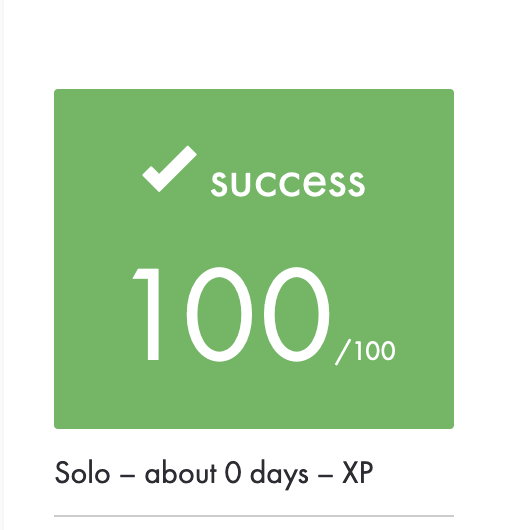

# exam_rank_06
Last exam of the 42 Cursus. Here to help further student in their struggle !

	

	
	
	
	

	
	
	
	

	
	<!--  -->
	<!--  -->

## How to test the project
I recommend you to use `netcat` to test your code. It will be the only binary you'll be able to use to in the exam session.

Server command launched with port 8888 :
`gcc -Wall -Wextra -Werror mini_serv.c && ./a.out 8888`

Client command :
`nc localhost 8888`

## Some additional informations
If a client disconnect himself the server and the other clients should be noticed whithout delay.

This version has a shitty technique for reading and sending messages so it can break on one of the test, usually the eighth test so feel free to repush if it fails. It passed on the first try for me.

If you try your code on macOs, the server can crash on the `bind()` function sometimes.
It happens if you relaunch your server too fast on the same port because the port is unavailable for a periode of time after you close the binding.

This code is only meant to help students to build their own version. I encourage anyone to code a better one especially for the message reception and processing part.
